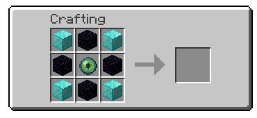

# Force Chunk Loading

Craft a configurable player head that keeps its chunk loaded. It works server-side with vanilla clients.

<p align="center">
  
</p>

## Features

- Configurable player-head skin, recipe, particles, and sounds.
- Chunk loading survives server restarts.
- Marker heads are protected from non-player destruction by default.
- Breaking a marker drops a reusable marker item.
- No client mod is required.

## Requirements

| Minecraft | Fabric Loader | Fabric API | Java |
| --- | --- | --- | --- |
| `26.1.2` | `0.19.3+` | `0.155.2+26.1.2` | `25+` |

## Installation

1. Install Fabric Loader and Fabric API on the dedicated server.
2. Put the `force_chunk_loading` JAR in the server's `mods` folder.
3. Start the server once to create the config.
4. Edit the config if needed, then restart the server.

The client does not need this mod installed.

## Use

Craft and place the player head shown above. The chunk is force-loaded after successful placement, with an activation message, sound, and optional enchanted particles.

Break the marker to deactivate it. In survival, the complete marker item drops and can be placed again. By default, explosions, pistons, commands, and other non-player changes restore the marker instead of removing it.

## Configuration

<details>
<summary>Show configuration</summary>

Edit this file while the server is stopped:

```text
config/force_chunk_loading.json
```

| Setting | Default | Purpose |
| --- | --- | --- |
| `allowPlacement` | `true` | Allow marker placement. |
| `placementPermissionLevel` | `0` | Required permission level, from `0` to `4`. |
| `allowPlayerRemoval` | `true` | Allow players to break markers. |
| `allowNonPlayerRemoval` | `false` | Let non-player changes remove markers permanently. |
| `showEnchantedParticles` | `true` | Show particles around active markers. |
| `sounds.enabled` | `true` | Enable activation/deactivation sounds. |
| `sounds.activation` | `minecraft:entity.player.levelup` | Placement sound ID. |
| `sounds.deactivation` | `minecraft:entity.enderman.teleport` | Removal sound ID. |
| `head.texture` | Earth texture | Base64 value from `profile.properties[].value`. |
| `recipe.enabled` | `true` | Enable the generated recipe. |
| `recipe.pattern` | `DOD`, `OEO`, `DOD` | Up to three rows of three characters. |
| `recipe.ingredients` | `D`, `O`, `E` | Maps characters to namespaced item IDs. |

`placementPermissionLevel: 0` allows everyone. Levels `1`–`4` require higher Minecraft permissions.

Use a registered namespaced sound ID. Set `sounds.enabled` to `false` to keep actionbar messages but disable sounds.

Change only `head.texture` to choose another skin. The command's custom name, lore, and head ID are not copied.

Restart the server after changing configuration.

</details>

## License

MIT. See [LICENSE](LICENSE).
